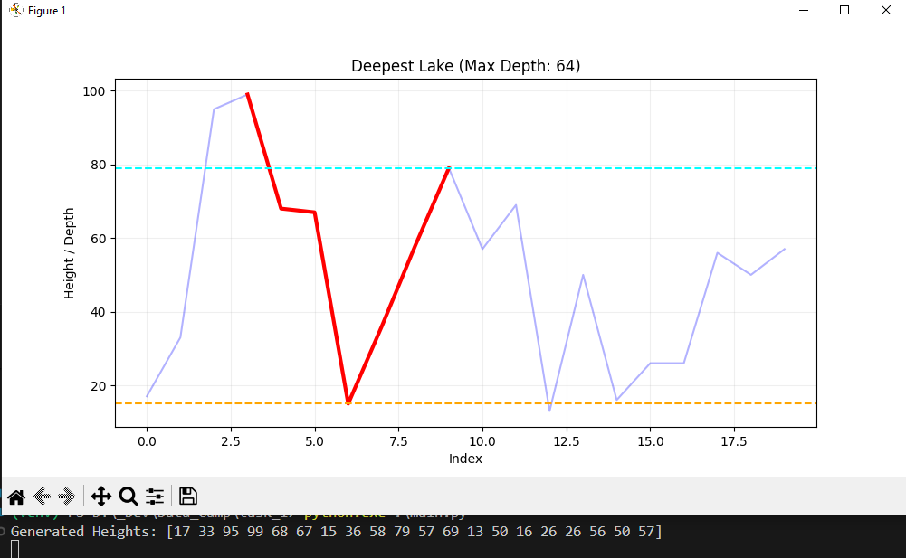
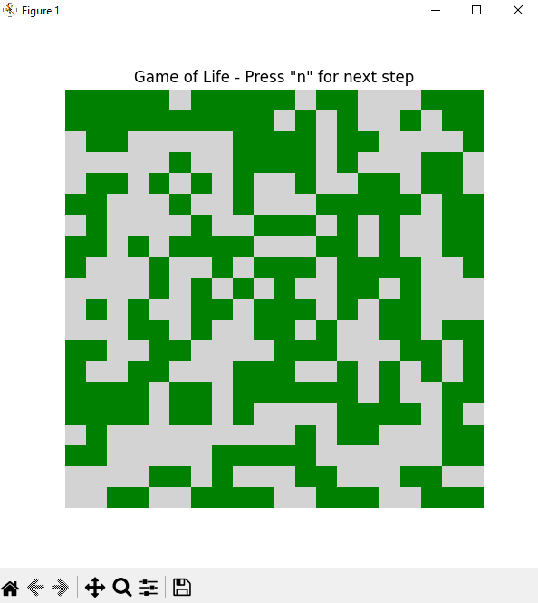
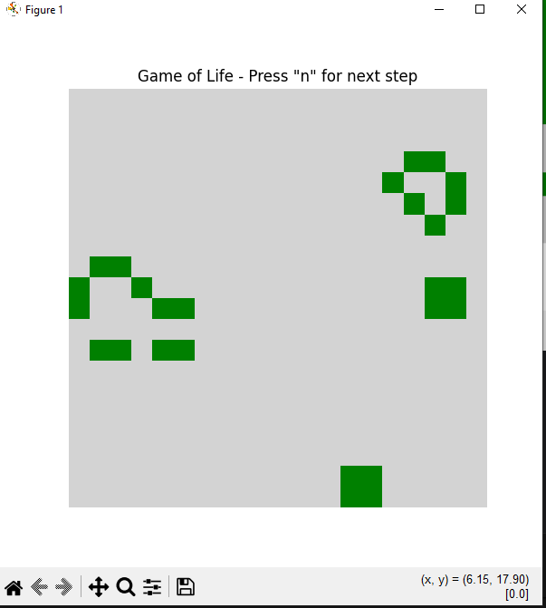

# Data Science Camp 2025 - Test Tasks Solutions

This repository contains my solutions for the Data Science Camp 2025 test assignments. Each section provides a brief overview of the problem and the methodology used to solve it.

---

### Task 1: Deepest Lake Analysis

---

## Task 2: Cellular Automaton

Init state:

Matrix state after 20 iterative steps

## Task 3: Biased Coins Probability

# P.S
I`m able to visit offline classes